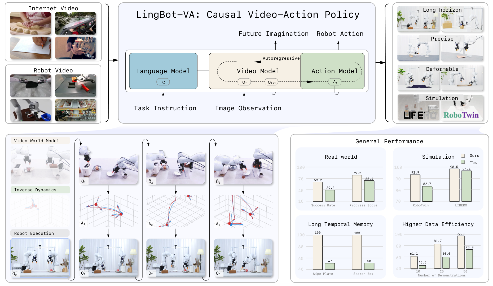

> **FBFM route:** this directory is the LingBot-VA x FBFM x RoboTwin
> implementation. The sibling DreamZero x LIBERO route lives at
> [`../dreamzero-libero`](../dreamzero-libero/README.md). FBFM-specific runtime,
> validation, and launch instructions are maintained in the RoboTwin evaluation
> section below and in [`docs/fbfm_runtime_modes.md`](docs/fbfm_runtime_modes.md).

<h1 align="center">LingBot-VA: Causal World Modeling for Robot Control</h1>

<p align="center">
  <a href="https://arxiv.org/abs/2601.21998"></a>
  <a href="https://technology.robbyant.com/lingbot-va"></a>
  <a href="https://huggingface.co/collections/robbyant/lingbot-va"></a>
  <a href="https://modelscope.cn/collections/Robbyant/LingBot-VA"></a>
  <a href="LICENSE.txt"></a>
</p>

<p align="center">
  
</p>


https://github.com/user-attachments/assets/cec7b7a6-953b-4fa4-8f1a-47efc1fce547


## 💫 Meet **LingBot-VA**!  We've built an AR diffusion framework for simultaneous world modeling and action! 🤖✨

**LingBot-VA** has focused on:
- **Autoregressive Video-Action World Modeling**: Architecturally unifies visual dynamics prediction and action inference within a single interleaved sequence while maintaining their conceptual distinction.
- **High-efficiency Execution**: A dual-stream mixture-of-transformers(MoT) architecture with Asynchronous Execution and KV Cache.
- **Long-Horizon Performance and Generalization**: High improvements in sample efficiency, long-horizon success rates, and generalization to novel scenes.

# 🚀 News
- **[2026-02-17]** Post-training code and dataset released! Support fine-tuning LingBot-VA on custom robotic manipulation datasets.
- **[2026-01-29]** Weights and code for shared backbone released! Please stay tuned for our separated version!


---


# 📦 Model Download
- **Pretrained Checkpoints for Post-Training**

| Model Name | Huggingface Repository | ModelScope Repository  | Description |
| :--- | :--- | :--- | :--- |
| lingbot-va-base &nbsp; | [🤗 robbyant/lingbot-va-base &nbsp;](https://huggingface.co/robbyant/lingbot-va-base) | [🤖 Robbyant/lingbot-va-base &nbsp;](https://modelscope.cn/models/Robbyant/lingbot-va-base)  | LingBot-VA w/ shared backbone|
| lingbot-va-posttrain-robotwin &nbsp; | [🤗 robbyant/lingbot-va-posttrain-robotwin &nbsp;](https://huggingface.co/robbyant/lingbot-va-posttrain-robotwin) | [🤖 Robbyant/lingbot-va-posttrain-robotwin &nbsp;](https://modelscope.cn/models/Robbyant/lingbot-va-posttrain-robotwin)  | LingBot-VA-Posttrain-Robotwin w/ shared backbone|

- **Post-Training Dataset**

| Dataset Name | Repository | Description |
| :--- | :--- | :--- |
| robotwin-clean-and-aug-lerobot &nbsp; | [🤗 robbyant/robotwin-clean-and-aug-lerobot](https://huggingface.co/datasets/robbyant/robotwin-clean-and-aug-lerobot) | Cleaned & augmented RoboTwin dataset in LeRobot format for post-training |
---

# 🛠️ Quick Start

## Installation
**Requirements**
 • Python == 3.10.16
 • Pytorch == 2.9.0
 • CUDA 12.6

```bash
pip install torch==2.9.0 torchvision==0.24.0 torchaudio==2.9.0 --index-url https://download.pytorch.org/whl/cu126
pip install websockets einops diffusers==0.36.0 transformers==4.55.2 accelerate msgpack opencv-python matplotlib ftfy easydict
pip install flash-attn --no-build-isolation
```


## ⚠️ Important: `attn_mode` Configuration

> **You MUST change the `attn_mode` setting depending on whether you are training or running inference.**
> Since LingBot-VA is loaded via `from_pretrained`, this parameter is read from the model folder's **`transformer/config.json`**.
> You need to **manually edit** this file before launching.
>
> | Mode | `attn_mode` value | Notes |
> |---|---|---|
> | **Training** | `"flex"` | Required for training. **Will not work** for inference. |
> | **Inference / Evaluation** | `"torch"` or `"flashattn"` | Required for inference. `"flex"` will cause errors at eval time. |
>
> **How to change:** Open `<your-model-path>/transformer/config.json`, find the `"attn_mode"` field, and set it to the appropriate value.

---

## Deploying LingBot-VA for Inference
LingBot-VA supports both standalone execution and Server-Client architecture which separates the model environment from simulation. By isolating dependencies, the design avoids package clashes and supports distributed inference on GPUs, clusters, and other devices.

<!-- ### Standalone  Inference
```python
python inference.py
```
This processes the example data from `examples/0/` and saves visualizations to `result/`. -->

### Evaluation on RoboTwin-2.0

#### NONE / RTC / FBFM formal evaluation on this workspace

The three modes use one implementation and one orchestration path.  They differ
only in the masks exposed to the flow-matching solver:

| launcher | state mask | action mask |
|---|---:|---:|
| `script/run_robotwin_none.sh` | all zero | all zero |
| `script/run_robotwin_rtc.sh` | all zero | RTC previous-action mask |
| `script/run_robotwin_fbfm.sh` | live observed slots | the same RTC mask |

An action at one control step is a complete 14D or 16D vector, not a scalar.
`H`, `d`, and `s` count control steps.  The time mask has layout
`(B,1,F,N,1)` and broadcasts over every component of the model action target
`(B,D,F,N,1)`.

The launchers require `ss` from `iproute2` and `flock`/`setsid` from
`util-linux`, in addition to Git, Bash 4+, the NVIDIA driver/CUDA stack, and the
Python environments below.

The canonical submission keeps the policy server and RoboTwin client in two
isolated Python 3.10 environments. From the FBFM monorepo root, fetch the pinned
sources, build the two environments, and verify the installation with:

```bash
export FBFM_ROOT="$(git rev-parse --show-toplevel)"
export FBFM_EXTERNAL_ROOT="${FBFM_EXTERNAL_ROOT:-$FBFM_ROOT/external}"
export FBFM_ENV_ROOT="${FBFM_ENV_ROOT:-$FBFM_ROOT/.venvs}"

bash scripts/bootstrap/fetch_upstreams.sh --route lingbot
bash scripts/bootstrap/create_envs.sh --route lingbot
"$FBFM_ENV_ROOT/fbfm-robotwin/bin/python" \
  scripts/bootstrap/fetch_robotwin_assets.py \
  --robotwin-root "$FBFM_EXTERNAL_ROOT/RoboTwin"
bash scripts/bootstrap/verify.sh --route lingbot --strict --assets

# Bounded CPU/import checks; this does not run a simulator episode.
bash scripts/smoke.sh lingbot
```

This produces the pinned `external/RoboTwin`, `external/pytorch3d`, and
`external/curobo` sources plus `.venvs/fbfm-lingbot-va` and
`.venvs/fbfm-robotwin` by default. The separate asset command downloads the
fixed RoboTwin Hugging Face snapshot, verifies all three archive SHA256 values,
extracts about 16 GB, and regenerates embodiment paths. Checkpoints and
RoboTwin assets are not redistributed by this repository; keep them outside
Git and set `LINGBOT_VA_MODEL` explicitly.

The policy environment uses Python 3.10.16, PyTorch 2.9.0+cu129,
torchvision 0.24.0+cu129, diffusers 0.36.0, transformers 4.55.2,
flash-attn 2.8.3.post1, and NumPy 1.26.4. The independent RoboTwin client
environment uses SAPIEN 3.0.0b1, MPlib 0.2.1, pinned PyTorch3D
`32a33e2`, and pinned CuRobo `0db44e5`. The bootstrap applies and verifies the
two compatibility edits made by RoboTwin's upstream installer. The checkpoint
directory must contain
`transformer/`, `vae/`, `text_encoder/`, and `tokenizer/`; for inference,
`transformer/config.json` must use `"attn_mode": "torch"` or
`"attn_mode": "flashattn"`, not `"flex"`.

No environment activation is required because the launchers invoke both Python
executables explicitly.

From the LingBot-VA repository root, launch one mode as follows.  The optional
positional argument is the number of RoboTwin episodes and defaults to 1:

```bash
export ROBOTWIN_ROOT="$FBFM_EXTERNAL_ROOT/RoboTwin"
export LINGBOT_SERVER_PYTHON="$FBFM_ENV_ROOT/fbfm-lingbot-va/bin/python"
export ROBOTWIN_CLIENT_PYTHON="$FBFM_ENV_ROOT/fbfm-robotwin/bin/python"
export LINGBOT_VA_MODEL=/path/to/lingbot-va-posttrain-robotwin
cd "$FBFM_ROOT/wam/lingbot-va"

# LingBot-VA baseline: both constraint masks are zero
bash script/run_robotwin_none.sh 1

# RTC: state mask is zero; previous complete action vectors are constrained
bash script/run_robotwin_rtc.sh 1

# FBFM: RTC action constraint plus live solver-step state feedback
bash script/run_robotwin_fbfm.sh 1
```

#### Paper task manifest and resumable multi-task launch

The AAAI submission evaluates the exact 42-task list in
[`config/robotwin_paper_tasks_42.txt`](config/robotwin_paper_tasks_42.txt).
[`config/robotwin_excluded_long_tasks_8.tsv`](config/robotwin_excluded_long_tasks_8.tsv)
records the eight excluded tasks and their upstream maximum-step budgets. Do not
silently substitute RoboTwin's built-in 50-task list when reproducing the paper.

With the single-run variables still exported, launch the FBFM task set from
this directory with:

```bash
export LINGBOT_VA_TASKS_FILE="$PWD/config/robotwin_paper_tasks_42.txt"
export LINGBOT_VA_ALL_TASKS_ROOT="$PWD/robotwin_outputs/fbfm_paper_42_$(date +%Y%m%d_%H%M%S)"
export ROBOTWIN_EPISODES_PER_TASK=20
export LINGBOT_VA_ALL_TASK_SHARDS=1  # raise to at most 3 only when VRAM permits

bash script/run_robotwin_all_tasks_fbfm.sh
```

The launcher is resumable. It validates completed `res.json` files, runs only
missing tasks, and atomically refreshes `aggregate.json`, `trials.csv`,
`task_summary.csv`, and `LIVE_STATUS.md`. Set
`LINGBOT_VA_ADJUST_BOTTLE_AGGREGATE` only to reuse a separately verified
`adjust_bottle` aggregate; the portable default reruns that task.

For a custom `NONE`, `RTC`, `FBFM`, or diagnostic `FBFM-static` subset, set
`LINGBOT_VA_CONSTRAINT_VARIANT`, `LINGBOT_VA_TASK_SET_ROOT`, and
`LINGBOT_VA_TASKS_FILE`, then run `script/run_robotwin_task_set.sh`. The
convenience `script/run_base_none_12x20.sh` uses the checked-in 12-task baseline
manifest and accepts the same environment overrides. The experiment-list
launcher and its aggregator/monitor are retained for the exact heterogeneous
continuation manifest in
[`config/robotwin_fbfm_completion_7cells_27ep.tsv`](config/robotwin_fbfm_completion_7cells_27ep.tsv);
they are provenance helpers, not a replacement for the 42-task headline run.

On the 97,887 MiB RTX PRO 6000, the validated 20-trial FBFM run can be split
across three isolated servers/simulators with:

```bash
bash script/run_robotwin_fbfm_20_parallel.sh
```

This launcher uses approximately 83 GiB at peak and is not suitable for a
smaller GPU without reducing the number of concurrent shards. It requires all
20 episode videos and the three `res.json` totals before writing
`aggregate.json`.

The launchers run the policy server and RoboTwin client together, validate that
`res.json` was produced, and always stop their own server on exit. Defaults are
the single GPU 0 for both policy and RoboTwin/CuRobo, WebSocket port 29156, and
torch master port 29161. The RTX PRO 6000 has enough memory for both processes;
RoboTwin uses the NVIDIA Vulkan raster backend with ray tracing disabled.
Override the device and port allocation before the command when necessary:

```bash
export LINGBOT_SERVER_GPU=0
export ROBOTWIN_CLIENT_GPU=0
export LINGBOT_VA_PORT=29156
export LINGBOT_VA_MASTER_PORT=29161
export LINGBOT_VA_ENABLE_OFFLOAD=1
bash script/run_robotwin_fbfm.sh 1
```

RTC parameters are shared by RTC and FBFM.  With action horizon `H=32`, the
default `d=16,s=16` has a hard prefix and no soft interval.  This example uses
a non-degenerate EXP soft interval `[d,H-s)=[4,20)`:

```bash
export LINGBOT_VA_RTC_DELAY=4
export LINGBOT_VA_RTC_EXECUTION_HORIZON=12
export LINGBOT_VA_RTC_ATTENTION_SCHEDULE=EXP  # or LINEAR
bash script/run_robotwin_rtc.sh 1
```

RoboTwin uses a deterministic pseudo-asynchronous schedule: 16 simulation steps
release exactly 26 video-flow evaluations by default. No measured wall-clock
delay changes `d` or the solver schedule. Override the solver budget with
`LINGBOT_VA_PSEUDO_VIDEO_SOLVER_STEPS` only when the configured number of video
inference steps also changes. FBFM live feedback is enabled by its launcher. For the
diagnostic FBFM-static ablation only, use
`bash script/run_constraint_ablation.sh FBFM-static 1`.

The scripts use headless NVIDIA Vulkan rasterization rather than SAPIEN ray
tracing. They set `ROBOTWIN_RENDER_BACKEND=default`,
`SAPIEN_DISABLE_RAY_TRACING=1`, and the NVIDIA Vulkan ICD; neither Xorg nor
`DISPLAY` is needed. Outputs and complete logs are written under
`robotwin_outputs/adjust_bottle_<mode>_<timestamp>/`.

The unified fetch already applies the included raster compatibility patch. The
following is only the manual alternative for a pristine pinned RoboTwin
checkout; do not apply it a second time after the bootstrap:

```bash
git apply /path/to/FBFM/wam/lingbot-va/patches/robotwin_raster_backend.patch
```

The patch preserves RoboTwin's upstream `rt` default and only selects the raster
path when `ROBOTWIN_RENDER_BACKEND=default` is explicitly set by these launchers.

Detailed timing semantics, deterministic replay, tests, and troubleshooting are
documented in [`docs/fbfm_runtime_modes.md`](docs/fbfm_runtime_modes.md).

#### Upstream LingBot-VA reference (legacy; not the FBFM reproduction entry point)

> The remainder of this README is retained from the upstream LingBot-VA
> project for provenance. Its launch scripts describe the upstream synchronous
> evaluation/training workflows and may still contain original cluster-specific
> defaults. They do not reproduce the AAAI FBFM protocol. For FBFM, use the
> canonical environment, launchers, 42-task manifest, and bounded smoke commands
> above (or the repository-root `README.md`).

**Preparing the Environment**

You can follow the official instructions from the original RoboTwin-2.0 repository:  
[https://robotwin-platform.github.io/doc/usage/robotwin-install.html](https://robotwin-platform.github.io/doc/usage/robotwin-install.html)


In summary:

1. 
```bash
sudo apt install libvulkan1 mesa-vulkan-drivers vulkan-tools
```

2. 
```bash
git clone https://github.com/RoboTwin-Platform/RoboTwin.git && cd RoboTwin && git checkout 2eeec322
```

3. modify script/requirements.txt 
```bash
transforms3d==0.4.2
sapien==3.0.0b1
scipy==1.10.1
mplib==0.2.1
gymnasium==0.29.1
trimesh==4.4.3
open3d==0.18.0
imageio==2.34.2
pydantic
zarr
openai
huggingface_hub==0.36.2
h5py
# For Description Generation
azure==4.0.0
azure-ai-inference
pyglet<2
wandb
moviepy
imageio
termcolor
av
matplotlib
ffmpeg
```

4. modify line 8 of script/_install.sh:
```bash
pip install "git+https://github.com/facebookresearch/pytorch3d.git@stable" --no-build-isolation
```

5. run:
```bash
bash script/_install.sh
```

6. run:
```bash
bash script/_download_assets.sh
```

 **Deploying the Inference Server**
```bash
# single GPU
bash evaluation/robotwin/launch_server.sh

# multi-GPU
bash evaluation/robotwin/launch_server_multigpus.sh
```

 **Executing the Inference Client**
```bash
# single GPU
task_name="adjust_bottle";
save_root="results/";
bash evaluation/robotwin/launch_client.sh ${save_root} ${task_name}

# multi-GPU
save_root="results/"
task_group_id=0;
bash evaluation/robotwin/launch_client_multigpus.sh ${save_root} ${task_group_id}
```

Related experiments results will be save in `/path/to/your/RoboTwin/${save_root}`. Please note that an `eval_result` folder is also generated. This is a native output from RoboTwin and is identical to the contents in the results folder; it can be safely ignored.
It is important to note that the inference server and client must be deployed on the same machine. For launching multi-GPU client, we padded the original 50 tasks to 56 via duplication and partitioned them into 7 groups to align with the 8-GPU configuration of our inference node. You can specify the `task_group_id` (0-6) to select a particular group for inference. For detailed grouping configurations, please refer to `evaluation/robotwin/launch_client_multigpus.sh`.

> **GPU Memory Requirements**: Approximately **24GB VRAM** for single-GPU RoboTwin evaluation with offload mode enabled (VAE and text_encoder offloaded to CPU).

### Run Image to Video-Action Generation

We also provide a script for image to video-action generation:

```bash
NGPU=1 CONFIG_NAME='robotwin_i2av' bash script/run_launch_va_server_sync.sh
```

> **GPU Memory Requirements**: Approximately **18GB VRAM** for single-GPU i2av inference with offload mode enabled (VAE and text_encoder offloaded to CPU).


## Post-Training LingBot-VA

We support post-training (fine-tuning) LingBot-VA on custom robotic manipulation datasets. The training pipeline uses FSDP for distributed training and integrates with [LeRobot](https://github.com/huggingface/lerobot) dataset format.

### Additional Dependencies

On top of the base installation, post-training requires:

```bash
pip install lerobot==0.3.3 scipy wandb --no-deps
```

### Data Preparation

Download the post-training dataset from HuggingFace:

```bash
huggingface-cli download --repo-type dataset robbyant/robotwin-clean-and-aug-lerobot --local-dir /path/to/your/dataset
```

### Custom Dataset Preparation

If you want to fine-tune LingBot-VA on your own robotic manipulation data, follow these steps:

#### Example Dataset

We provide a converted example dataset based on data from [Issue #29](https://github.com/Robbyant/lingbot-va/issues/29). This dataset has been converted into the expected format and is fully supported for training. You can download it to understand the required data structure:

- **Download**: [Example Dataset](https://drive.google.com/file/d/1D52nK4ZOJmWBXKv1nWrLb9YBwq8nKa_b/view?usp=sharing)

This example can serve as a reference for converting your own robotic manipulation data into the proper format.

#### Data Pipeline Overview

When preparing your custom dataset, the data goes through the following processing pipeline:

1. **Raw Data** → Convert to LeRobot format (with metadata and video files)
2. **Add Action Segmentation** → Add `action_config` to `episodes.jsonl`
3. **Extract Latents** → Process videos through VAE according to video specifications
4. **Dataset Loading** → Load processed data with proper action dimensions for training

The final data should conform to these specifications:

**Action Format:**
- Output dimension: **30 dimensions**, structured as follows:
  - Left arm EEF (end-effector): 7 dimensions
  - Right arm EEF (end-effector): 7 dimensions
  - Left arm joints: 7 dimensions
  - Right arm joints: 7 dimensions
  - Left arm gripper: 1 dimension
  - Right arm gripper: 1 dimension
- In your dataset class loader, map your robot's action dimensions to this standard 30-dimensional format. Missing dimensions are padded with **0**.

**Video Format:**
- During VAE latent extraction, resize videos to **~256 × 256 pixels** and downsample to **5-15 fps** as a reference (adjust based on your task requirements).

#### Implementation Steps

**Step 1: Convert your data to LeRobot format**

Follow the official [LeRobot dataset documentation](https://github.com/huggingface/lerobot/tree/v0.3.3) to convert your raw data (e.g., HDF5, video files, etc.) into the standard LeRobot dataset format. Ensure that each episode contains the required observation videos, actions, and metadata.

**Step 2: Add `action_config` field to `episodes.jsonl`**

After converting to LeRobot format, you need to modify the `meta/episodes.jsonl` file to add an `action_config` field to each line. This field describes the temporal segmentation and natural language description of the robot's actions within each episode.

Each line in `episodes.jsonl` should follow this format:

```json
{
  "episode_index": 0,
  "tasks": ["task description"],
  "length": 450,
  "action_config": [
    {
      "start_frame": 0,
      "end_frame": 450,
      "action_text": "Natural language description of the robot action in this segment.",
    }
  ]
}
```

- `start_frame` / `end_frame`: The frame range (0-indexed) of the action segment within the episode.
- `action_text`: A natural language description of what the robot does in this segment.

For episodes with a single continuous action, `start_frame` should be `0` and `end_frame` should equal the episode `length`. You can also define multiple segments per episode if your data contains sequential sub-tasks.

**Step 3: Extract video latents with Wan2.2 VAE**

LingBot-VA operates on video latent representations rather than raw pixels. You need to extract the latent features using the Wan2.2 VAE encoder and place them under the converted LeRobot dataset directory. Please refer to the [Wan-Video documentation](https://github.com/Wan-Video) for instructions on how to run the VAE encoder.

The extracted latent files should be placed under `latents/` in your dataset directory, mirroring the structure of `videos/`:

```
your_dataset/
├── videos/
│   └── chunk-000/
│       └── observation.images.cam_high/
│           ├── episode_000000.mp4
│           └── ...
├── latents/
│   └── chunk-000/
│       └── observation.images.cam_high/
│           ├── episode_000000_0_450.pth    # named as episode_{index}_{start_frame}_{end_frame}.pth
│           └── ...
└── meta/
    └── episodes.jsonl
```

Each `.pth` file is a dictionary containing the following fields:

| Key | Type | Description |
| :--- | :--- | :--- |
| `latent` | `Tensor [N, C]` (bfloat16) | Flattened VAE latent features (e.g., shape `[latent_num_frames * latent_height * latent_width, C]`) |
| `latent_num_frames` | `int` | Number of temporal frames in the latent space |
| `latent_height` | `int` | Spatial height in the latent space |
| `latent_width` | `int` | Spatial width in the latent space |
| `video_num_frames` | `int` | Number of frames in the (sampled) source video |
| `video_height` | `int` | Original video height in pixels |
| `video_width` | `int` | Original video width in pixels |
| `text_emb` | `Tensor [L, D]` (bfloat16) | Text embedding of the action description (encoded by Wan2.2 text encoder) |
| `text` | `str` | The raw action description text |
| `frame_ids` | `list[int]` | Sampled frame indices from the original episode (at target fps) |
| `start_frame` | `int` | Start frame index matching `action_config` in `episodes.jsonl` |
| `end_frame` | `int` | End frame index matching `action_config` in `episodes.jsonl` |
| `fps` | `int` | Target sampling fps used for latent extraction |
| `ori_fps` | `int` | Original fps of the episode data |

The latent file naming convention `episode_{index}_{start_frame}_{end_frame}.pth` corresponds to the `action_config` segments defined in `episodes.jsonl`. For example, an episode with `"start_frame": 0, "end_frame": 450` produces a latent file named `episode_000000_0_450.pth`.

### Training

```bash
NGPU=8 bash script/run_va_posttrain.sh
```

For better training performance, use a larger global batch size (e.g., 32, 64). If you have limited GPU resources, you can increase `gradient_accumulation_steps` to achieve a larger effective batch size.


---

# 📊 Performance

We evaluate our model on both simulation benchmarks and real-world scenarios, and achieve state-of-the-art performance.

## Simulation Evaluation

- **RoboTwin 2.0**

We are the first to propel RoboTwin 2.0 metrics performance past the 90+ threshold！
<table style="border-collapse: collapse; width: auto; font-family: -apple-system, BlinkMacSystemFont, 'Segoe UI', Roboto, Arial, sans-serif; font-size: 13px; line-height: 1.2;">
<!-- 指标说明 -->
  <p style="font-size: 12px; color: #666; margin-bottom: 5px;">* All metrics are reported in percentage (%). Higher values are <b>bolded</b>.</p>
  <thead>
    <tr style="border-top: 2px solid black; border-bottom: 1px solid black;">
      <th align="left" style="padding: 6px 12px; white-space: nowrap;">Method (Average 50 Tasks)</th>
      <th align="center" style="padding: 6px 12px;">Easy SR (%)</th>
      <th align="center" style="padding: 6px 12px;">Hard SR (%)</th>
    </tr>
  </thead>
  <tbody>
    <tr>
      <td style="padding: 4px 12px; white-space: nowrap;">X-VLA</td>
      <td align="center">72.9</td>
      <td align="center">72.8</td>
    </tr>
    <tr>
      <td style="padding: 4px 12px; white-space: nowrap;">&pi;<sub>0</sub></td>
      <td align="center">65.9</td>
      <td align="center">58.4</td>
    </tr>
    <tr>
      <td style="padding: 4px 12px; white-space: nowrap;">&pi;<sub>0.5</sub></td>
      <td align="center">82.7</td>
      <td align="center">76.8</td>
    </tr>
    <tr>
      <td style="padding: 4px 12px; white-space: nowrap;">Motus</td>
      <td align="center"><u>88.7</u></td>
      <td align="center"><u>87.0</u></td>
    </tr>
    <tr style="border-top: 1px solid black; border-bottom: 2px solid black;">
      <td style="padding: 6px 12px; white-space: nowrap;"><b>LingBot-VA (Ours)</b></td>
      <td align="center"><b>92.9</b> <small>(+4.2)</small></td>
      <td align="center"><b>91.6</b> <small>(+4.6)</small></td>
    </tr>
  </tbody>
</table>


- **LIBERO**

<table style="border-collapse: collapse; width: auto; font-family: -apple-system, BlinkMacSystemFont, 'Segoe UI', Roboto, Arial, sans-serif; font-size: 13px; line-height: 1.2;">
<!-- 指标说明 -->
  <p style="font-size: 12px; color: #666; margin-bottom: 5px;">* All metrics are reported in percentage (%). Higher values are <b>bolded</b>.</p>
  <thead>
    <tr style="border-top: 2px solid black; border-bottom: 1px solid black;">
      <th align="left" style="padding: 6px 10px; border-right: 1px solid black; white-space: nowrap;">Methods</th>
      <th align="center" style="padding: 6px 8px;">Spatial</th>
      <th align="center" style="padding: 6px 8px;">Object</th>
      <th align="center" style="padding: 6px 8px;">Goal</th>
      <th align="center" style="padding: 6px 8px;">Long</th>
      <th align="center" style="padding: 6px 8px;">Avg</th>
    </tr>
  </thead>
  <tbody>
    <tr>
      <td style="padding: 4px 10px; border-right: 1px solid black; white-space: nowrap;">&pi;<sub>0</sub></td>
      <td align="center">96.8</td><td align="center">98.8</td><td align="center">95.8</td><td align="center">85.2</td><td align="center">94.1</td>
    </tr>
    <tr>
      <td style="padding: 4px 10px; border-right: 1px solid black; white-space: nowrap;">&pi;<sub>0.5</sub></td>
      <td align="center">98.8</td><td align="center">98.2</td><td align="center">98.0</td><td align="center">92.4</td><td align="center">96.9</td>
    </tr>
    <tr>
      <td style="padding: 4px 10px; border-right: 1px solid black; white-space: nowrap;">OpenVLA</td>
      <td align="center">84.7</td><td align="center">88.4</td><td align="center">79.2</td><td align="center">53.7</td><td align="center">76.5</td>
    </tr>
    <tr>
      <td style="padding: 4px 10px; border-right: 1px solid black; white-space: nowrap;">X-VLA</td>
      <td align="center">98.2</td><td align="center">98.6</td><td align="center">97.8</td><td align="center">97.6</td><td align="center">98.1</td>
    </tr>
    <tr style="border-top: 1.5px solid black; border-bottom: 2px solid black;">
      <td style="padding: 5px 10px; border-right: 1px solid black; white-space: nowrap;"><b>LingBot-VA (Ours)</b></td>
      <td align="center"><b>98.5 &plusmn; 0.3</b></td>
      <td align="center"><b>99.6 &plusmn; 0.3</b></td>
      <td align="center"><b>97.2 &plusmn; 0.2</b></td>
      <td align="center"><b>98.5 &plusmn; 0.5</b></td>
      <td align="center"><b>98.5</b></td>
    </tr>
  </tbody>
</table>


&nbsp;

## Real-world Deployment

Six manipulation tasks across three categories: longhorizon tasks (Make Breakfast, Pick Screws), precision tasks (Insert Tube, Unpack Delivery), and deformable & articulated object
manipulation (Fold Clothes, Fold Pants). Our method achieves state-of-the-art performance on both metrics (Progress Rate and Success Rate) with <b>only 50 trials</b> per task, substantially outperforming strong baseline &pi;<sub>0.5</sub>.

<div style="text-align: left; font-family: -apple-system, BlinkMacSystemFont, 'Segoe UI', Roboto, Arial, sans-serif; line-height: 1.6;">

  <!-- 第一部分：PS 说明 -->
  <div style="margin-bottom: 5px;"><strong>Progress Score (PS):</strong> The average score across all trials divided by the maximum possible score, expressed as a percentage:</div>

  PS = Average_Progress / Max_Steps &times; 100%

  <!-- 第二部分：SR 说明 -->
  <div style="margin-bottom: 5px;"><strong>Success Rate (SR):</strong> The number of successful trials divided by the total number of trials, expressed as a percentage:</div>

  SR = Successful_Trials / N &times; 100%

</div>


<div style="font-family: -apple-system, BlinkMacSystemFont, 'Segoe UI', Roboto, Arial, sans-serif;">
  <!-- 指标说明 -->
  <p style="font-size: 12px; color: #666; margin-bottom: 5px;">* All metrics are reported in percentage (%). Higher values are <b>bolded</b>.</p>
  
  <table style="border-collapse: collapse; width: auto; font-size: 13px; line-height: 1.2;">
    <thead>
      <tr style="border-top: 2px solid black;">
        <th rowspan="2" align="left" style="padding: 4px 10px; border-bottom: 1px solid black; white-space: nowrap;"><b>Task</b></th>
        <th colspan="2" style="padding: 4px 10px; border-bottom: 1px solid black;">Make Breakfast</th>
        <th colspan="2" style="padding: 4px 10px; border-bottom: 1px solid black;">Pick Screws</th>
        <th colspan="2" style="padding: 4px 10px; border-bottom: 1px solid black;">Insert Tube</th>
        <th colspan="2" style="padding: 4px 10px; border-bottom: 1px solid black;">Unpack Delivery</th>
        <th colspan="2" style="padding: 4px 10px; border-bottom: 1px solid black;">Fold Clothes</th>
        <th colspan="2" style="padding: 4px 10px; border-bottom: 1px solid black;">Fold Pants</th>
      </tr>
      <tr style="border-bottom: 1px solid black;">
        <th style="padding: 4px 8px;">PS</th>
        <th style="padding: 4px 8px;">SR</th>
        <th style="padding: 4px 8px;">PS</th>
        <th style="padding: 4px 8px;">SR</th>
        <th style="padding: 4px 8px;">PS</th>
        <th style="padding: 4px 8px;">SR</th>
        <th style="padding: 4px 8px;">PS</th>
        <th style="padding: 4px 8px;">SR</th>
        <th style="padding: 4px 8px;">PS</th>
        <th style="padding: 4px 8px;">SR</th>
        <th style="padding: 4px 8px;">PS</th>
        <th style="padding: 4px 8px;">SR</th>
      </tr>
    </thead>
    <tbody>
      <tr>
        <td style="padding: 6px 10px; white-space: nowrap;">&pi;<sub>0.5</sub></td>
        <td align="center">73.0</td><td align="center">70.0</td>
        <td align="center">74.0</td><td align="center">50.0</td>
        <td align="center">79.2</td><td align="center">30.0</td>
        <td align="center">73.0</td><td align="center">25.0</td>
        <td align="center"><b>62.9</b></td><td align="center">30.0</td>
        <td align="center">30.0</td><td align="center">30.0</td>
      </tr>
      <tr style="border-bottom: 2px solid black;">
        <td style="padding: 6px 10px; white-space: nowrap;"><b>LingBot-VA (Ours)</b></td>
        <td align="center"><b>97.0</b></td><td align="center"><b>75.0</b></td>
        <td align="center"><b>82.5</b></td><td align="center"><b>70.0</b></td>
        <td align="center"><b>85.8</b></td><td align="center"><b>40.0</b></td>
        <td align="center"><b>84.5</b></td><td align="center"><b>65.0</b></td>
        <td align="center">48.8</td><td align="center"><b>35.0</b></td>
        <td align="center"><b>76.7</b></td><td align="center"><b>70.0</b></td>
      </tr>
    </tbody>
  </table>
</div>


# 🪪 License

This project is released under the Apache License 2.0. See [LICENSE](LICENSE.txt) file for details.

# 📚Citation

```bibtex
@article{lingbot-va2026,
  title={Causal World Modeling for Robot Control},
  author={Li, Lin and Zhang, Qihang and Luo, Yiming and Yang, Shuai and Wang, Ruilin and Han, Fei and Yu, Mingrui and Gao, Zelin and Xue, Nan and Zhu, Xing and Shen, Yujun and Xu, Yinghao},
  journal={arXiv preprint arXiv:2601.21998},
  year={2026}
}
```

# 🧩 Acknowledgments

This work builds upon several excellent open-source projects:

- [Wan-Video](https://github.com/Wan-Video) - Vision transformer backbone
- [MoT](https://github.com/facebookresearch/Mixture-of-Transformers) - Mixture-of-Transformers architecture
- The broader open-source computer vision and robotics communities

---

For questions, discussions, or collaborations:

- **Issues**: Open an [issue](https://github.com/robbyant/lingbot-va/issues) on GitHub
- **Email**: Contact Dr. [Qihang Zhang](https://zqh0253.github.io/) (liuhuan.zqh@antgroup.com) or Dr. [Lin Li](https://lilin-hitcrt.github.io/) (fengchang.ll@antgroup.com) 
